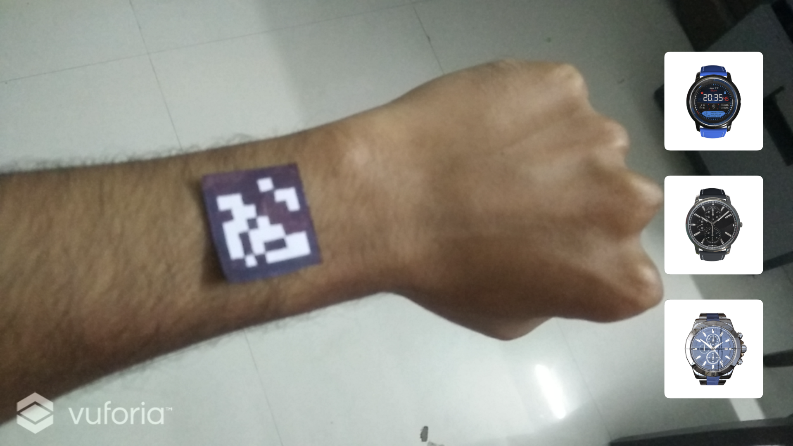
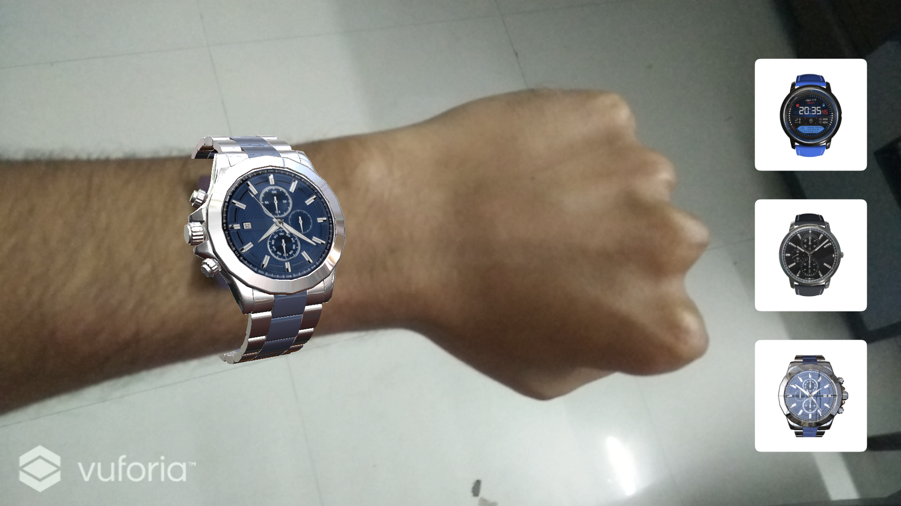
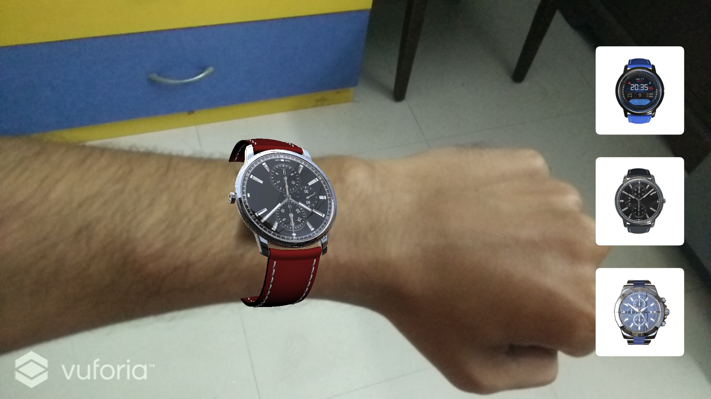

# ARWatches

Marker based AR application which allows users to try different 3d watch models with color customisations. The 3d watch object would be mounted so that it appears to wrap around user's wrist. This has been acheived by using a dummy 3d hand model and applying a mask shader on it to occludes the lower part of watch model which will wrap around the wrist.

### Tools
- Unity and Vuforia.

### Language
- C#

### Custom marker used

### Sample screenshots

